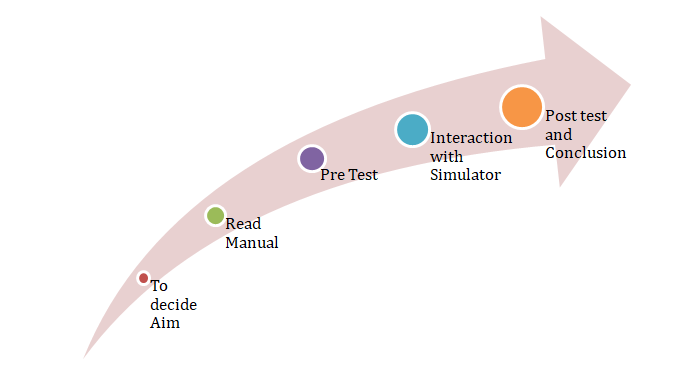
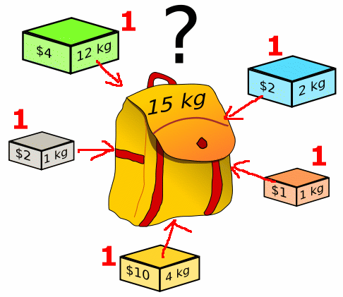

## Storyboard (Round 2)

### Experiment 1: 0/1 Knapsack

### 1. Story Outline:

Given weights and values of n items, put these items in a knapsack of capacity W(maximum weight of bag) to get the maximum total value in the knapsack. In other words, given two integer arrays val[0..n-1] and wt[0..n-1] which represent values and weights associated with n items respectively. Also given an integer W which represent knapsack capacity, find out the maximum value subset of val[] such that sum of the weights of this items is smaller than or equal to W. You cannot break an item, either pick the complete item, or don’t pick it (0-1 property).
## 2. Story:

### 2.1	Set the Visual Stage Description:
### Optimal Substructure:
To consider all subsets of items, there can be two cases for every item: (1) the item is included in the optimal subset, (2) not included in the optimal set.
Therefore, the maximum value that can be obtained from n items is max of following two values.
1) Maximum value obtained by n-1 items and W weight (excluding nth item).
2) Value of nth item plus maximum value obtained by n-1 items and W minus weight of the nth item (including nth item).

If weight of nth item is greater than W, then the nth item cannot be included and case 1 is the only possibility.

### 2.2	Set User Objectives & Goals:
1.	To get (profit/weight) ratio for per unit.
2.	Check the capacity of bag.
3.	The item having maximum ratio corresponding weight is checked that the weight is smaller than the remaining capacity of the bag. 
4.	If bag have capacity to store weight put that weight into the bag else left it.
5.	Again check the remaining all item and apply above situation.
6. Add the corresponding profit also.

 

 

### 2.3 Set the pathway activites:

Student will follow the the following steps:
1.Student will have to enter weights and profits in the assinged tables. 
2.Click on the table's below given button, it will give the (profit/weight) .
3.Student will enter the capacity of the bag.
4.Simulator will put the item with maximum profit into the bag according to the capacity of the bag. 
5.Simulator will gives the desired maxmium gained profit according to the greedy profit 0/1 Knapsack algorithm.

### 2.4 Set Challenges and Questions/Complexity/Variations in Questions:
1. Student will be asked questions based on various cognitive levels. List of questions provided in Round 1 document.

2. Student will be asked to solve questions based on experiment.

### 2.5.Allow pitfalls:
1. The student will not have to enter the negative weights.
2. Negative profit are not allowed to be filled in the given table.

### 2.6.Conclusion:
 Study of Dynamic programing algorithm has been done. Maximum profit gained in greedy profit algorithm has been calculated.

### 2.7. Formulas and equations used :

Formulas:  

Ratio =Profit of item/ Weight of item 
Sum of all the profits which items are in the bag.
  

### 3.FLOWCHART: 
 
### 4.MINDMAP: 
 

### 5.STORYBOARD:
 

### 6.Some particular images

