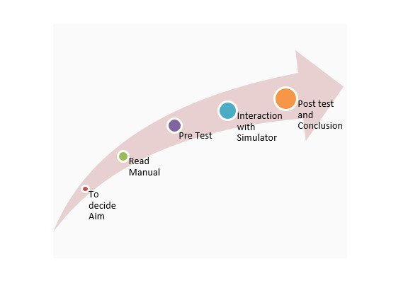
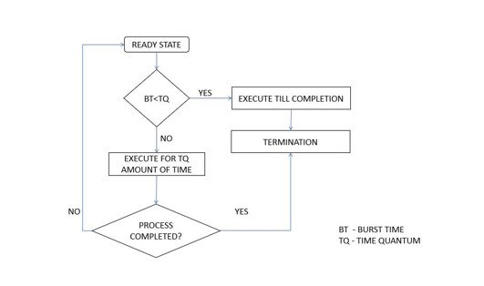
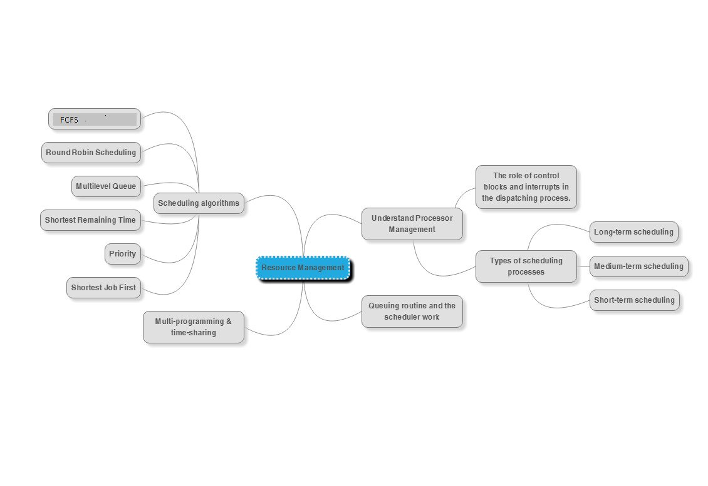
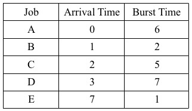

## Storyboard (Round 2)

Experiment 1: CPU Scheduling

### 1. Story Outline:

In the "First come first serve" scheduling algorithm, as the name suggests, the process which arrives first, gets executed first, or we
can say that the process which requests the CPU first, gets the CPU allocated first.
### 2. Story:

### 2.1	Set the Visual Stage Description:
1.	First Come First Serve, is just like FIFO(First in First out) Queue data structure, where the data element which is added to the 
queue first, is the one who leaves the queue first.
2.	This is used in Batch Systems.
3.	It's easy to understand and implement programmatically, using a Queue data structure, where a new process enters through the tail
of the queue, and the scheduler selects process from the head of the queue.
4.	A perfect real life example of FCFS scheduling is buying tickets at ticket counter.

### 2.2	Set User Objectives & Goals:
1.	Draw the Gantt -chart for given problem.
2.	 According to Gantt chart indexing find out completion time for each process
3.	Turn-around time 
4.	Waiting time 
5.	Response time 

 

 

### 2.3 Set the pathway activites:

Student will follow the the following steps:
1.Student will have to enter the arrival time and burst time.
2.Click on the gantt chart side given button,it will gives you the completion time of each process in gantt chart..
3.Click on the button given below the turn around time table.
4.It will gives you the waiting time and turn around time.
5.Click on the button given below the average waiting time.
6.Simulator will gives the desired average waiting time result.

### 2.4 Set Challenges and Questions/Complexity/Variations in Questions:
1. Student will be asked questions based on various cognitive levels. List of questions provided in Round 1 document.

2. Student will be asked to solve questions based on experiment.

### 2.5.Allow pitfalls:
1. The student will have to enter the arrival time in the incresing order.
2. Negative values arer not allowed to be filled in the given table.

### 2.6.Conclusion:
 Study of CPU Scheduling has been done. Average waiting time has been calculated.

### 2.7. Formulas and equations used :

Formulas:  

Turn Around Time = Completion Time – Arrival Time 
Waiting Time = Turn Around Time – Burst Time 
Average Waiting time=(sum of waiting time of all process)/number of process  

### 3.FLOWCHART: 
 
### 4.MINDMAP: 
 

### 3. User objective goals
1. To study the CPU Scheduling.
2. To determine the average waiting time.

### 4. Challenges and Questions

##### 1.	Find the completion time for the job D ?
  <b> a) 8 </b> 
  b) 20 
  c) 13
  ANS:-B

##### 2.	Find the turn around time for the job C ?
  <b> a)	11  </b>
  b) 7
  c) 14
  ANS:-A

##### 3.Find the turn around time for the job C ?
  a) 5.6
  b)	6.2
  c) 6.8
  ANS:-C

### 5.STORYBOARD:
 

### 6.Some particular images

